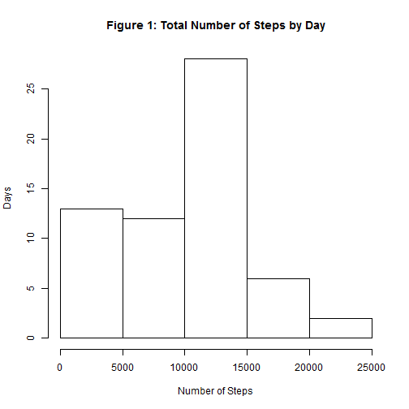
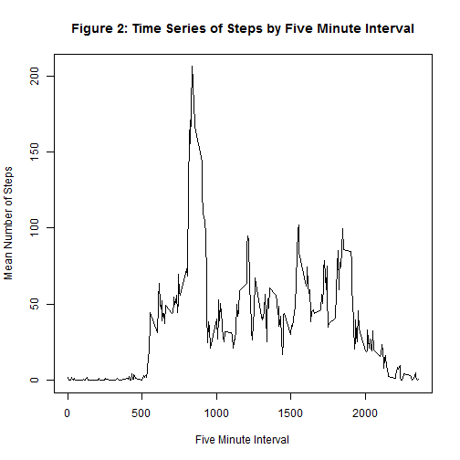
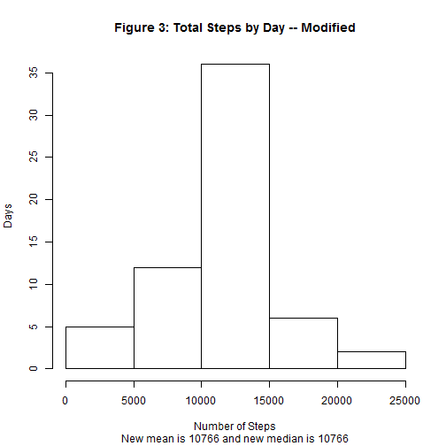
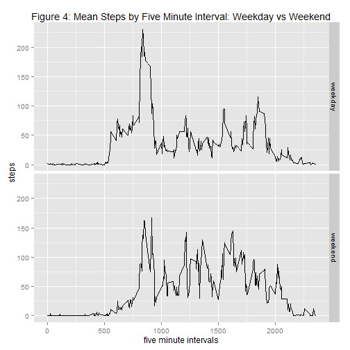

## Loading and preprocessing the data
We begin by loading the data, in this case from the CSV file from within the zip file archive.


```r
myZipFile <- "C:/Users/Andy/git/RepData_PeerAssessment1/activity.zip"
myFile <- "activity.csv"
myData <- read.csv(unz(myZipFile, "activity.csv"))
head(myData)
```

```
##   steps       date interval
## 1    NA 2012-10-01        0
## 2    NA 2012-10-01        5
## 3    NA 2012-10-01       10
## 4    NA 2012-10-01       15
## 5    NA 2012-10-01       20
## 6    NA 2012-10-01       25
```


## What is mean total number of steps taken per day?
Here we'll visualize the distribution of *total steps by date*.


```r
totalStepsByDay <- tapply(myData$steps, myData$date, sum, na.rm = T)
hist(totalStepsByDay, main = "Figure 1: Total Number of Steps by Day", 
     xlab = "Number of Steps", ylab = "Days")
```

 

Now we can look at the *mean and median* of the distribution above. We see that the distribution is mildly skewed to the left (mean < median).


```r
meanByDay <- mean(tapply(myData$steps, myData$date, sum, na.rm = T), na.rm = T)
paste("The mean is ", round(meanByDay,0), sep ="")
```

```
## [1] "The mean is 9354"
```

```r
medianByDay <- median(tapply(myData$steps, myData$date, sum, na.rm = T), na.rm = T)
paste("The median is ", round(medianByDay,0), sep ="")
```

```
## [1] "The median is 10395"
```


## What is the average daily activity pattern?
Now we take a look at the basic time series properties of the number of steps taken by each 5-minute interval. Specifically, we plot the average number of steps taken by 5-minute interval, averaged across all days in the dataset.


```r
meanByInterval <- tapply(myData$steps, myData$interval, mean, na.rm = T)
plot(x = names(meanByInterval), y = meanByInterval, type = "l",
     xlab = "Five Minute Interval", ylab = "Mean Number of Steps", main = "Figure 2: Time Series of Steps by Five Minute Interval")
```

 


In the plot above we see that the interval labels (x-axis) map to the 288 (12 * 24) five minute intervals during a day. Interval label zero corresponds to 12:00AM and interval 2355 corresponds to 11:55 PM. We can see from the plot that the max number of steps, on average in this data set, occur during the mid morning hours. Specicically, the code below sorts and displays the data to show the maximum occurs at 8:35AM with a mean of roughly 206 steps.


```r
sortByMeanInterval <- meanByInterval[order(meanByInterval,decreasing = T)]
round(sortByMeanInterval[1],1)
```

```
##   835 
## 206.2
```

## Imputing missing values

We can see that there are a considerable number of NA values in the dataset in the *steps* column. Specifically:


```r
paste("There are ", sum(is.na(myData$steps)), " NA values for steps", sep = "")
```

```
## [1] "There are 2304 NA values for steps"
```

Our simple strategy to replace NA values with the mean value for the 5-minute interval in which the NA resides, where the mean is calculated over all days in the dataset.

To do this without a package in base R, we can create a column of mean by interval, copied (stacked) by number of days (61 in this dataset) so the dimensions conform to the original dataset, Then we can just use and ifelse() statement to keep valid values and replace NA values, as follows:


```r
columnMeanByInterval <- rep(meanByInterval, 61)
myData2 <- myData
myData2$steps <- ifelse(is.na(myData2$steps),columnMeanByInterval,myData2$steps)
```


Now we can take a look at the distribution of Our new dataset, including its mean and median. *We see that the data are less skewed, e.g. the mean and median are now equal.*


```r
totalStepsByDay2 <- tapply(myData2$steps, myData2$date, sum, na.rm = T)
hist(totalStepsByDay2, main = "Figure 3: Total Steps by Day -- Modified", 
     xlab = "Number of Steps", ylab = "Days")
meanByDay2 <- round(mean(totalStepsByDay2, na.rm = T),0)
medianByDay2 <- round(median(totalStepsByDay2, na.rm = T),0)
paste("The new mean is ", round(meanByDay2,0), sep ="")
```

```
## [1] "The new mean is 10766"
```

```r
paste("The new median is ", round(medianByDay2,0), sep ="")
```

```
## [1] "The new median is 10766"
```

```r
title(sub = paste("New mean is ", meanByDay2 , " and new median is ", medianByDay2, sep = ""))
```

 

## Are there differences in activity patterns between weekdays and weekends?
Still using our modified dataset that replaced NA values, we'll look into patterns that differ by weekday and weekend. To do this we'll create a new column with dates called "weekDay". Then we'll use this new column to add yet another new column, a factor column called "weekEnd" that has two levels: {"weekend", "weekday"}. Finally we'll use qplot() to create a partitioned plot to visualize any differences across weekdays and weekends.


```r
myData2$weekDay <- weekdays(as.Date(myData2$date, "%Y-%m-%d"))
myData2$weekEnd <- ifelse(myData2$weekDay == "Saturday"| myData2$weekDay == "Sunday", "weekend", "weekday")

library(ggplot2)
qplot(interval, steps, data = myData2, stat = "summary", fun.y = "mean", 
      geom = "line", facets = weekEnd ~ ., 
      main = "Figure 4: Mean Steps by Five Minute Interval: Weekday vs Weekend", 
      xlab = "five minute intervals", ylab = "steps")
```

 
